# 👋 Hello, I'm Reiko Iwata!

### ✨ Aspiring Developer | Learning Every Day ✨

### ✒ About Me

職業訓練校でのチーム開発を通じて、技術の基礎から実践までを

丁寧に学んでまいりました💻開発をする上で大切にしているのは

<b>「粘り強く調べ、一歩ずつ丁寧に進めること」</b>です📚

未学習の技術に直面した際も、公式ドキュメントを読み

理解を深めながら解決の糸口を探すプロセスを踏むようにしています

共にプロジェクトを進める皆様がスムーズに作業を進められるよう

<b>「読みやすく、丁寧に整えられた誠実なコード」</b>

を書くことをこころがけ、日々精進してまいります✨

---

### 🛠️ My Skill Palette

  
  
  
  
   
  
  
  
  

---

### 🛠️ Languages & Tools

私がこれまでに触れてきた言語の統計データです

  

---

### 📊 My Coding Activity

GitHub Actionsにより自動生成される最新の開発統計です

  

---

### ☁️ Let's Connect!

  
  

---

✨ 𝓣𝓱𝓪𝓷𝓴 𝔂𝓸𝓾 𝓯𝓸𝓻 𝓿𝓲𝓼𝓲𝓽𝓲𝓷𝓰 ✨

  

